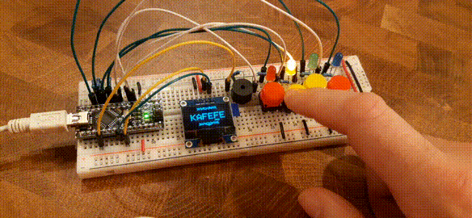

# Ivrea – a place for my electronics experiments

**Warning:** I have no idea what I'm doing here, so don't use this unless you know what you're doing.

Recently, I started experimenting a bit with electronics, using Arduino, ICs and a ton of LEDs amongst other things. This repository contains information on various [projects I did](#projects--sketches), also including code, as well as a curated list of [resources](#resources) I found useful.

## Projects / Sketches

Here are the projects I did and plan to do.

### Morse

The [morse Arduino code](morse) was my very first project, I wrote the code even before my Arduino arrived, it requires no wiring as it works with the built-in LED when the Arduino is connected to a computer via USB. It reads ASCII from the serial, converts to morse code, and then makes an LED blink accordingly. Of course you could hook this up to a relay to drive an even bigger light.

After some time I decided to write a [test suite for this sketch in `test.cpp`](morse/test.cpp) inspired by [`rfielding/octaveRounder`'s tests](https://github.com/rfielding/octaveRounder/blob/master/test/harness.cpp) which allows me to write new features without having to connect an Arduino.

### Fade LED array

My second project creates a smooth marquee of LEDs using PWM, and also uses an input from a poti for speed control. This showcases the analog capabilities of the Arduino unit. The code in [`fadeLedArray.ino`](fadeLedArray.ino) might require some fine-tuning depending on the exact LED you use. The wiring is also very easy, just connect the LEDs to the PWP pins and ground with a resistor in series, and the middle pin from the poti to an analog pin. To smooth out the analog readings I used the code from [`readAnalogVoltageSmooth.ino`](readAnalogVoltageSmooth.ino).

### LED piano

The [LED piano](./ledPiano) is a fun and debugging project. The [Arduino code](ledPiano/ledPiano.ino) is reading messages from the serial port like `H4`, `L1` etc. to toggle pins high and low. You could just send those from the serial monitor in Arduino IDE, but it's way faster and fun to do it from a browser. This way you can also do it on a phone, or some other computer in the same network. For that, there is [a server written](ledPiano/index.js) with [node.js](https://nodejs.org/), [express](https://expressjs.com/), [ws](https://github.com/websockets/ws) and [serialport](https://serialport.io/) libraries that will accept messages from a websocket connection and forward them to a serial port. It also serves a [basic client file in plain JS](ledPiano/public/index.html) that displays some buttons for control, and also accepts touch and keyboard input. Aside from driving LEDs, this can also be used to fiddle with ICs without having to wire many things and debouncing buttons and so on.

### Shift Registers

After using basic LEDs only I wanted to try out the bargraphs and some ICs and started with the 74HC595 8-bit shift register, creating [`shiftRegisters.ino`](shiftRegisters.ino). It can control two shift registers which in turn control bargrahps and show some nice visuals. The project is a bit like [this shift out example](https://www.arduino.cc/en/Tutorial/Foundations/ShiftOut)) except that it generates some patterns and also accepts some commands form serial port to control:

* `I`: toggle wether to show intermediate register states or only latch once all bits are in place
* `D0`, `D1`, `D2`: control delay when shifting out the bits, so you can watch either the sendout or the results
* `R000`–`R999`: control how long each "image" is shown after the serial transmission is complete

The wiring is a bit more elaborate for this one, so I have a [higher-res image showing how to wire things up on a breadboard](shiftRegisters.jpg?raw=true). White is the serial clock, blue is the output latch clock, yellow is the data and a small piece for cascading into the second shift register.

### LED Matrix

When I got my hands on a `1588BS` 8x8 pixel LED matrix, I wanted to use the Arduino as a driver. Luckily it has more then 16 I/O pins available, so you can directly connect the 8 anodes and 8 cathodes (with a resistor). I my wiring is quite a mess, I had to test the matrix with the diode setting in the multimeter to even find out how the ports are laid out. I then wrote [`ledMatrix.ino`](ledMatrix.ino) first to test if everything is hooked up correctly and working, but then proceeded to add a dozen effects. I used a struct and function pointers to make it easy to configure the effects, otherwise the code is rather unspectacular.

#### Pong

Since the nano has two analog pins that can not be used as digital pins anyway, I hooked up two potentiometers to those which can control two "paddles" on the LED matrix and created a small Pong-like game for it in [`ledMatrixPong.ino`](ledMatrixPong.ino). I found myself having so many global variables for the state of the ball, the paddles and more, that I refreshed my C++ knowledge and used classes and an enum to make things a little bit more elegant. I spend most of the time on displaying the score nicely in the end. It's quite playable, even tough 8x8 pixel resolution is somewhat limiting. As the game progresses, the ball gets a bit faster over time to keep it challenging.

### Temperature display

Another two components from the starter kit that go nicely together are the DHT 11 temperature and humidity sensor and the LCD screen. At this place I actually found the wiring and programming not so rewarding, it was mostly an exercise in wiring up all the pins correctly and embedding some libraries, as documented in [`temperatureDisplay.ino`](temperatureDisplay.ino). I took a cheap powerbank that I won on the Southside festival and brought the breadboard with the whole installation into the blistering cold outside to see if it works. Instead of just displaying the values on the LCD I also designed a set of icons for temperature (sun, cloud, snowflake) and humidity (droplet in 3 sizes) which change depending on the sensor values to give this project a least a small creative edge.

### Ultrasonic sensor and buzzer

Next I tested the HC-SR04 ultrasonic sensor and the passive buzzer. Again, it felt straightforward to set it up, the buzzer can be connected to any digital pin (and ground) and the HC-SR04 gets voltage supplies, a trigger pin to start a measurement and an echo pin which can be read with the `pulseIn` Arduino function. I build a contraption that works like parking sensor and modifies the buzzer frequency based on the distance in [`parkHelper.ino`](parkHelper.ino), however, I found the readings were all over the place, and I don't even own a car, so I gave up on this. At some place I might build a radar with the servo and Processing...

With the same circuit I also coded [`elfenlied.ino`](elfenlied.ino) which will play the Lilium melody on the buzzer. I put in a small resistor so that the buzzer is not so loud during debugging. I think the buzzer might be a good addition to some of the games to provide a multimedial experience. The Arduino with the `Tone` library can only play one frequency on a square wave, so it's really limited in its current form.

### 2048 game

The number 2048 is not only 211 but also the name of a well-known arcade game. It only needs 4x4 tiles, 4 buttons for the 4 directions and maybe a bit of score and highscore display. And it's a lot of fun. So I picked it as a candidate to develop a more complex game on the 128x64 Pixel OLED screen. The screen is connected with I2C and the buttons with pull-ups, so the hardware can be constructed in no time. However, for the software in [`2048.ino`](2048/2048.ino) and other files I ventured into some new areas. I looked at [this Arduino code](https://github.com/zhaofengli/2048-arduino/blob/master/board.h) and [this JS code](https://github.com/gabrielecirulli/2048/blob/master/js/game_manager.js) to understand the game logic, but in the end I developed it myself again, as I didn't quite understand their code.

What's so cool about it? The highscore is saved in the EEPROM. There are individual desings for the tiles which were exported from a [sprite image](2048/sprite.png) with a small Go script [`transformSprite.go`](2048/transformSprite.go) – they look artsy, but are hard to read, maybe I'll change tham. And then there's even a 3D animation when reaching the 2048 tile, rendered from the [Blender3D](blender.org) file [`animation.blend`](2048/animation.blend) and exported into bitmap frames using [`transformFrames.go`](2048/transformFrames.go). It fills almost the whole flash memory. Welp! But I think it was worth it.

Maybe I'll turn this into a hardware project at some place again, The buttons are a bit annoying to press, put it in a nice case with a battery, ...?

### LED Brainz

I saw the video [Arduino LED Memory Game](https://www.youtube.com/watch?v=Tcp_6L80kY0) featured on YouTube, where someone built this [Simon Says game from sparkfun](https://learn.sparkfun.com/tutorials/simon-says-assembly-guide/all) (without their custom PCB) and I thought this is easy to build based on my breadboard from the 2048 game. In addition to the 4 buttons, I added 4 LEDs and a buzzer. And since the OLED screen was also attached, I used it to display some instructions and the score, the code is in [`ledBrainz.ino`](ledBrainz/ledBrainz.ino). I actually really enjoy doing these pixel graphics, and I also added [`transformBitmap.go`](transformBitmap.go) which is a generic command line tool to transform PNGs into C arrays. I later found out that this Simon game has actually a longer history, see [this video](https://www.youtube.com/watch?v=OxcPWusnIAg) and the linked resources.

 

### Word shuffle game

Another game idea I found was a word sorting game. The MCU gives you a random permutation of a word and you have to rearrange the letters to build the original word. The code is in [`wrodShuflfe.ino`](wrodShuflfe/wrodShuflfe.ino) (the name of the game is the 0st level already) and I also added a list of 78 basic German words, that you can guess. Even though I knew the words, it was still challenging, e.g. `PFLAE` is formed from a perfectly normal German word, but it took me some time to figure it out. As a bit of nostalgia I used C strings with `strlen` and `strcmp` as well as the in-place-XOR-swap trick. And now I know why people avoid those. And ofc I built some "pixel art" as decorations.

### Snake game

I almost forgot how fun snake as a game was. Back in the Nokia 3310 days it was my favorite pastime for some time, so I had to re-implement it as well. And what can I say – it's still addictive. The code is in [`snek.ino`](snek/snek.ino). I had to limit the field size to 21x12 to make the the maximum snake length fit into a `uint8_t` and thus not fill the 2 KB memory of the Nano so quickly, while still allowing to fill the whole field with snake.

For some time I thought about a way to store not only my 2048 high score, but also my snake high score in the EEPROM at the same time, and I came up with some basic file system. But then I realized that my idea is the same that the "Overly Simplified File System" from [`charlesbaynham/OSFS`](https://github.com/charlesbaynham/OSFS) already implements so I migrated my storage to this system using [`initOsfsEeprom.ino`](initOsfsEeprom/initOsfsEeprom.ino) and some [migration code for 2048](https://github.com/bxt/ivrea/commit/efa2e601ce7d70f9a5459edaf29609c3408d3b79).

I was also curious how fast the various code bits actually run so I wrote some [timing code](https://github.com/bxt/ivrea/commit/6e1f95201eb98190553b70c67da136cdc932f61c) and while my game code is taking less than 2ms, sending the buffer to the OLED via I2C/TWI takes a whopping 37ms, so I guess one way of optimization would be only sending the changed regions, which would be possible from the screen's protocol, but the graphics library I'm using does not support that. Maybe some time in the future, I'll roll my own.

I also finally took the time to replace the jumper wires with some 22 AWG solid wire, because the jumpers kept hanging over the OLED. I also found when you enter ["snake" into Goolge](https://www.google.com/search?q=snake) you can actually play the game, a graphically polished version of it with animations and more game modes, like multiple mice, swiss-cheese-snake and so on.

### LED strip curling

After I got my hands on a 5m long LED strip, I was eager to test what could be done with it. My first experiments were to turn on/off single LEDs, which resulted in a sketch for sending out "worms", one in each color red, green and blue which is in [`ledStripWorms.ino`](ledStripWorms/ledStripWorms.ino). You can use a button to re-spawn a worm. I also tried a typical rainbow pattern in [`ledStripRainbow.ino`](ledStripRainbow/ledStripRainbow.ino) because it's really easy to do with FastLED. I was actually surprised that the Arduino seems to have no problem driving and powering the 300 LEDs at a decent performance if you don't increase the brightness too much.

Then I wanted to start something bigger, and I did a game inspired by curling, [`ledStripCurling.ino`](ledStripCurling/ledStripCurling.ino). Aside from the 300 RGB LEDs it only uses a button and a buzzer. You hold down the button, the longer you hold the farther on the strip you "shoot", and the buzzer frequency gives you a hint how long you're holding. You'll try to hit a target area. If you land where another player has already landed, you displace their stone. After 3 shots, you get a score by how many of your stones are closer than any other player's stone. After a few rounds ("ends") whoever has accumulated the most point wins and a celebration animation in their respective color is displayed. There are a few differences to regular curling: I do also count stones landed outside the target area ("house") and since the LED strip is only 1-dimensional, you always pass through other player's stones en route. Also there's no strict limits on how many players/teams there are. And unfortunately sweeping is not possible.

### Planned projects / ideas

* Game similar to froggy on the LED Matrix
* More games on the LED Matrix? Jump & Run, Breakout, maze, snake...
* More games on the OLED? Jump & Run, Breakout, maze, [adinfinitvm](https://bxt.github.io/adinfinitvm/)...
* RGB LED controller?
* Kitchen timer set with poti, counting on 4 segments, and flashing RGB-LED and Buzzer when done. (Maybe Wifi tmp & and a clock as well?)
* Game controlled with remote control, maybe tic tac toe?
* Programming an EEPROM to drive the shift registers, so no Arduino is needed
* Well, the 8 bit CPU...
* As well as the "reliable data transmissions" series
* Maybe: Using Ardiuno as a general purpose debugger / controller via [firmata](https://github.com/firmata/arduino) and some node / React app, basically the "LED piano" in fancy
* Maybe: Some kind of keyboard matrix like this [Mini Macro Keyboard](https://www.thingiverse.com/thing:2822140) or this [SparkFun Cherry MX Chorded Keyer](https://www.youtube.com/watch?v=GGNV3bmZrdg) or this [sawed off keyboard](https://hackaday.com/2017/09/18/sawed-off-keyboard/) using the [Cherry MX switch](https://www.cherrymx.de/dev.html). Parts maybe form [this switch tester](https://www.amazon.de/AKWOX-Cherry-Switch-Keyboard-Sampler/dp/B01GZHU1EG/) or switches individually ([with click](https://www.reichelt.de/cherry-mx-blue-keyswitch-cherry-mx1a-e1nn-p202569.html), [without click](https://www.reichelt.de/cherry-mx-brown-rgb-tastenmodul-cherry-mx1a-g1na-p258097.html), [smooth](https://www.reichelt.de/cherry-mx-red-rgb-tastenmodul-cherry-mx1a-l1na-p258098.html) or from digikey) and caps ([getdigital](https://www.getdigital.de/Tasten-fuer-Mechanische-Tastaturen-WASD-Sets.html) or [digikey](https://www.digikey.de/product-detail/de/sparkfun-electronics/PRT-15306/1568-PRT-15306-ND/10130909) or from old keyboard?) and [breakout board](https://www.digikey.de/catalog/de/partgroup/cherry-mx-switch-breakout-board/61112) or custom PCB? See also: [very good instructions](https://learn.sparkfun.com/tutorials/cherry-mx-switch-breakout-hookup-guide), [full keyboard project](https://www.thingiverse.com/thing:2704567))
* Maybe: hack a gamepad, e.g. the mini NES ones with something like [`WiiAccessoryToUSB`](https://github.com/DougBarry/WiiAccessoryToUSB) or a [USB one](https://www.conrad.de/de/p/joy-it-gamepad-snes-design-gamepad-raspberry-pi-universal-grau-1954771.html) or just buy a [fitting one](https://www.conrad.de/de/p/joy-it-sbc-wl-controller-arduino-erweiterungs-platine-schwarz-passend-fuer-einplatinen-computer-arduino-1613300.html)
* Try out some various more-or-less Arduino compatible hardware and related software, like Teensy, Blue/Black Pill, Witty cloud, ESP8266, ESP32, TTGO, NodeMCU...

## Resources

Over time, I collected some useful resources like [instructional videos](#instructional-videos), [references](#references), a [glossary and german translations](#glossary-and-german-translations), info about [sourcing](#sourcing) components.

### Instructional videos

* [A simple guide to electronic components.](https://www.youtube.com/watch?v=6Maq5IyHSuc): pretty cool recap of the vary basics, like what are resistors, capacitors, LEDs, diodes, transistors, explaining Ohm's law, ...
* [Datasheets: 16x2 LCD By Hand (No microcontroller)](https://www.youtube.com/watch?v=cXpeTxC3_A4): good example with basic information on breadboard & IC basics, how to read datasheets, pull down/up resistors, button debounce.
* [Ben Eater (channel)](https://www.youtube.com/c/BenEater): This has a lot of great info, as you can tell from the playlist titles «Building an 8-bit breadboard computer!», «Networking tutorial», «Build a 65c02-based computer from scratch
».
* [Don't Take Capacitors for Granted](https://www.youtube.com/watch?v=rr7bPmGTQUk): how to get polarity right.
* [Beginner's Guide to Soldering Electronics](https://www.youtube.com/watch?v=M2Jf8cebwCs): explaining the various options and how poisonous they are.
* [Inside a Small Chinese Electronics Factory - From the Archives](https://www.youtube.com/watch?v=HF0E8WeEUVM&list=LL&index=6): How SMD components were printed on in a factory.

### References

#### 8 bit CPU

* [Ben Eater's website](https://eater.net/) with the [parts list](https://eater.net/8bit/parts) and the [schematics](https://eater.net/8bit/schematics) for the 8 bit computer amongst many other things
* [/r/beneater](https://www.reddit.com/r/beneater) with [lordmonoxide's posts](https://www.reddit.com/r/beneater/comments/dskbug/what_i_have_learned_a_master_list_of_what_to_do/) containing  and [CalliGuy's post](https://www.reddit.com/r/beneater/comments/ii113p/helpful_tips_and_recommendations_for_ben_eaters/) containing lots of gotchas
* [«7400-series integrated circuits» on Wikipedia](https://en.wikipedia.org/wiki/7400-series_integrated_circuits) and the [list](https://en.wikipedia.org/wiki/List_of_7400-series_integrated_circuits) explain numbers like `SN74LS08`, as does [bigger-hammer's post](https://www.reddit.com/r/beneater/comments/js3ozw/8bit_parts_online_aliex/gby3g3l/) and the [futurlec IC74LS00 Series shop page](https://www.futurlec.com/IC74LS00Series.shtml)
* [Logic Signal Voltage Levels](https://www.allaboutcircuits.com/textbook/digital/chpt-3/logic-signal-voltage-levels/) cool comparison between TTL and CMOS / LS and HC from [this post](https://www.reddit.com/r/beneater/comments/j5ixle/can_i_mix_ls_and_hc_logic_gates/), see also [this answer](https://electronics.stackexchange.com/a/358628/268618)
* [A high-res picture of a finished build](https://i.imgur.com/um8YhA2.jpg)

#### Arduino

* [Arduino Foundations](https://www.arduino.cc/en/Tutorial/Foundations) portal into most documentation
* [Arduino Built-In Examples](https://www.arduino.cc/en/Tutorial/BuiltInExamples), the codes form the examples menu but with circuits and explanations
* [Arduino "language" reference](https://www.arduino.cc/reference/en/): with the API and yeah also C++ if you want
* [Arduino nano](https://store.arduino.cc/arduino-nano), page about the board type I'm using, check the tech specs, docs and FAQ tabs as well
* [JOY-IT nano V3](https://joy-it.net/de/products/ARD_NanoV3), the actual "Arduino-compatible" board I'm using, check the driver download and "ATmega328P (Old Bootloader)" instructions
* [PROGMEM](https://www.arduino.cc/reference/en/language/variables/utilities/progmem/) and [AVR PGM Program Space Utilities](https://www.nongnu.org/avr-libc/user-manual/group__avr__pgmspace.html)
* There's the [Arduino memory](https://www.arduino.cc/en/Tutorial/Foundations/Memory) page, but really think: Flash ~ CD with program, SRAM ~ RAM – duh, EEPROM ~ hard disk.

#### General

* [ASCII table](https://de.wikipedia.org/wiki/American_Standard_Code_for_Information_Interchange#ASCII-Tabelle) for converting bits / numbers to letters and back manually
* Wikipedia articles about [ICs](https://en.wikipedia.org/wiki/Integrated_circuit)
* [How to Use a Breadboard](https://learn.sparkfun.com/tutorials/how-to-use-a-breadboard/all) comprehensive tutorial about the very basics
* Also in the shopping list below you can usually find the data sheets about the particular components

### Glossary and German translations

* `V` / Voltage in volt, de: Spannung in Volt
* `I` / Current in amps / amperes, de: Strom / Stromstärke in Ampere
* `R` / Resistor in ohms, de: Wiederstand in Ohm
* Capacitor, de: Kondensator
* Resistor, de: Widerstand
* Solderless THT / through-hole technology / Breadboard / dual-in-line / DIP packaging / 0.1 inch, de: Steckboard, 2,54 mm
* THT (not Solderless but also DIP sized hole distances), de: Lochrasterplatine
* SMD / Surface-mounted device / PCP / "the very small chips", de: Platine, Leiterplatte
* VCC / VDD / "5V", de: Pluspol, Spannungsquelle
* GND / Ground / VSS / 0V, de: Minuspol, Masse
* Serial:
  * I2C / I²C / Inter-Integrated Circuit / I-Squared-C / TWI / Two-Wire-Interface: Bus with 2 wires (SDA, SCL), 1 controller and N peripherals with 7-bit addresses (often hardcoded)
  * SPI / Serial Peripheral Interface, Bus with 4 wires (SCK/SCLK, SS/Slave-/chip-select, and 2 duplexed data wires. They are called MOSI/MISO or SDO/SDI (then cross connected). 1 Controller and N peripherals with SS.
  * UART / Universal Asynchronous Receiver Transmitter: Bus with 2 wires for sending and retrieving, synced via start/stop bits.

### Sourcing

#### Shops

[Reichelt](https://www.reichelt.de/), [Mouser](https://www.mouser.de/), [Conrad](https://www.conrad.de/), [Pollin](https://www.pollin.de/), [Amazon](https://www.amazon.de/), [Digi-Key](https://www.digikey.de/)...

#### Shopping list

You can just buy the [kit from Ben directly](https://eater.net/8bit/kits) which I would recommend. But I was not sure about shipping to Germany (especially with taxes) and I wanted some extra / custom parts, so I procured everything individually. I'm not sure whether I have everything, and also some things are not 100% compatible and will require some tinkering, but for me it's useful to have a list of the exact parts in my inventory and maybe someone else can buy similar things.

##### Tools and supplies

* USB power supply, Screwdriver, wire cutters, pilers, and box cutter I already had
* [Wire stripper from Jokari](https://www.amazon.de/-/en/gp/product/B002BDNL4Q)
* [Digital Multimeter from Crenova](https://www.amazon.de/-/en/gp/product/B01825GBK2)
* [22 AWG solid wire kit](https://www.amazon.de/-/en/gp/product/B07V5FVSYL)
* [Jumper wire kit](https://www.reichelt.de/flexible-drahtbruecken-15-cm-mehrfarbig-65er-pack-rnd-255-00009-p253202.html), [Bus jumper wires](https://www.amazon.de/AZDelivery-Jumper-Arduino-Raspberry-Breadboard/dp/B074P726ZR)
* Breadboards: [4k7v](https://www.reichelt.de/experimentier-steckboard-2560-700-kontakte-steckboard-4k7v-p67683.html), [BB830](https://www.mouser.de/ProductDetail/BusBoard-Prototype-Systems/BB830?qs=VEfmQw3KOauhPeTwYxNCaA%3D%3D), [BB830T](https://www.mouser.de/ProductDetail/BusBoard-Prototype-Systems/BB830T?qs=VEfmQw3KOauXY1NKV2FuEg%3D%3D)
* [Header pins](https://www.reichelt.de/stiftleiste-3-polig-raster-2-54mm-bkl-10120200-p235647.html)
* [ESD-15 tweezers, screwdriver, ...](https://www.amazon.de/gp/product/B07XTCJGR3)
* Soldering station: is on my wishlist

##### Basic components

* [Resistors](https://www.amazon.de/-/en/gp/product/B08DKT3STN)
* [Electrolytic capacitors](https://www.amazon.de/-/en/gp/product/B07NWGDH2T)
* [Ceramic capacitors](https://www.amazon.de/gp/product/B07PP7SFY8) and [0.01µF ones](https://www.reichelt.de/tantalkondensator-100-nf-35-v-avx-tap104m035cc-p246447.html)
* [1MΩ potentiometer](https://www.reichelt.de/drehpotentiometer-mono-1-0-mohm-4mm-linear-po4m-lin-1-0m-p88275.html)
* [Slide switch](https://www.reichelt.de/schiebeschalter-gerade-rm5-08-1x-ein-ein-ss-25436-nh-p105713.html)
* DIP switch [4-position](https://www.reichelt.de/dip-schalter-printmontage-liegend-4-polig-rnd-210-00164-p226385.html), [8-position](https://www.reichelt.de/dip-schalter-printmontage-liegend-8-polig-rnd-210-00166-p226387.html)
* Momentary tact pushbutton/switch: ordered various, will pick one to list later
* [Mosfet](https://www.reichelt.de/mosfet-n-ch-60v-0-5a-0-35w-to-92-bs-170-p5856.html): is on my whishlist
* [3,7V 1100mAh Lipo](https://www.amazon.de/gp/product/B087LTZW61/)

##### LEDs

* [LEDs sortiment](https://www.reichelt.de/led-sortiment-5-mm-superhell-vorwiderstaende-fassungen-quad-1801o004-p280142.html)
* [7-segment LED displays, common cathode](https://www.reichelt.de/7-segment-anzeige-superrot-14-2mm-gem-kathode-sc-56-11-srt-p80388.html)
* Bargraph [yellow](https://www.reichelt.de/bargraph-anzeige-10-elemente-gelb-ybg-1000-p22957.html), [green](https://www.reichelt.de/bargraph-anzeige-10-elemente-gruen-gbg-1000-p8141.html), [green/red](https://www.reichelt.de/bargraph-anzeige-10-elemente-3x-rot-7x-gruen-rgbg-1000-p31501.html)
* 5V LEDs with resistor: [green](https://www.reichelt.de/led-5-mm-bedrahtet-5-v-gruen-20-mcd-30--kbt-l-7113gd-5v-p231091.html), [yellow](https://www.reichelt.de/led-5-mm-bedrahtet-5-v-gelb-20-mcd-30--kbt-l-7113yd-5v-p231097.html), [red](https://www.reichelt.de/led-5-mm-bedrahtet-5-v-rot-30-mcd-30--kbt-l-7113id-5v-p231093.html)
* [128x64 OLED screen](https://www.reichelt.de/entwicklerboards-display-0-96-oled-display-ssd1306-debo-oled2-0-96-p266107.html) ([SBC-OLED01](https://joy-it.net/de/products/SBC-OLED01), [Adafruit_SSD1306](https://github.com/adafruit/Adafruit_SSD1306), [GFX](https://learn.adafruit.com/adafruit-gfx-graphics-library))
* LED matrix: 1588BS from starter kit, [pinout](http://www.zpag.net/Electroniques/Arduino/8x8_dot_matrix_1588bs.html)
* Addressable LED strip: [BTF-LIGHTING WS2812B 5M * 60/m = 300LEDs RGB](https://www.amazon.de/gp/product/B01CDTEG1O/)

##### Bigger ICs / MCUs

* [Arduino nano clone](https://www.reichelt.de/arduino-kompatibles-nano-board-atmega328-mini-usb-ard-nano-v3-p225690.html)
* ["74189 64-bit RAM"](https://www.reichelt.de/sram-32-kb-4-k-x-8-4-5--5-5-v-dil-28-62256-80-p2673.html) **(I only got a bigger one, maybe [this post and links there](https://www.reddit.com/r/beneater/comments/hon6ar/74189_alternative/) help)**
* [28C16 EEPROMs](https://www.reichelt.de/eeprom-64-kb-8-k-x-8-5-v-150-ns-pdip-28-28c64-150-p1946.html) and [mount](https://www.reichelt.de/praezisionsfassung-28-polig-rm-2-54-mpe-001-2-028-3-p213785.html) (the 16K ones are unavailable, so I got 64K)
* [LM-555 Timer ICs](https://www.reichelt.de/timer-ic-typ-555-dip-8-lm-555-cn-p187567.html) and [mount](https://www.reichelt.de/praezisionsfassung-8-polig-rm-2-54-mpe-001-1-008-3-p213777.html)
* [Arduino UNO R3 clone with starter kit](https://www.amazon.de/gp/product/B014L11IN6)
* [TTGO Display](https://www.amazon.de/gp/product/B07VNG9D52/)

##### 7400er ICs

* [74LS04 Hex inverter](https://www.reichelt.de/inverter-hex-4-5--5-5-v-dil-14-74hct-04-p3306.html) 5×
* [74LS08 Quad 2-input AND gate](https://www.reichelt.de/and-gate-2-element-4-5--5-5-v-dil-14-74hct-08-p3307.html) 3×
* [74LS00 quad NAND gate](https://www.reichelt.de/nand-gate-2-input-4-5--5-5-v-dil-14-74hct-00-p3303.html) 2×
* [74LS02 quad NOR gate](https://www.reichelt.de/nor-gate-2-input-4-5--5-5-v-dil-14-74hct-02-p3304.html) 1×
* [74LS32 Quad 2-input OR gate](https://www.reichelt.de/4-fach-oder-gatter-je-2-eingaenge-4-5--5-5-v-dil-14-74hct-32-p3369.html) 1×
* [74LS86 Quad XOR gate](https://www.reichelt.de/xor-gate-2-input-4-75--5-25-v-dil-14-ls-86-p10826.html) 2×
* [74LS157 quad 2-1 line mux](https://www.reichelt.de/multiplexer-lp-schottky-4-75--5-25-v-dil-16-ls-157-p10625.html) 4×
* [74LS107 dual J-K flip-flop](https://www.reichelt.de/flip-flop-d-type-dual-4-5--5-5-v-dil-14-74hct-107-p3309.html) 1×
* [74LS138 3-to-8 line decoder](https://www.reichelt.de/decoder-3-to-8-4-5--5-5-v-dil-16-74hct-138-p3318.html) 1×
* [74LS139 2-to-4 line decoder](https://www.reichelt.de/dekoder-demultiplexer-2-auf-4-4-5--5-5-v-dip-16-74hct-139-p3319.html) 1×
* [74LS161 4-bit binary counter](https://www.reichelt.de/counter-4-bit-4-75--5-25-v-dil-16-ls-163-p10630.html) 2× **(I only got the 163 with slightly different specs)**
* [74LS173 4-bit D register](https://www.mouser.de/ProductDetail/Texas-Instruments/SN74LS173AN?qs=nMmhAzRCgdAkY4Cck6ihbQ%3D%3D) 8×
* [74LS273 8-bit D register](https://www.reichelt.de/flip-flop-d-type-octal-4-5--5-5-v-dil-20-74hct-273-p3363.html) 1×
* [74HC595 8-bit shift register](https://www.reichelt.de/shift-register-3-state-ausgang-2--6-v-dil-16-74hc-595-p3269.html) 2×
* [74LS245 8-bit bus transceiver](https://www.reichelt.de/octal-bus-puffer-3-state-4-5--5-5-v-dil-20-74hct-245-p3356.html) 6×
* [74LS283 4-bit binary adder](https://www.mouser.de/ProductDetail/Texas-Instruments/SN74LS283N?qs=RnzODY3cU8uVeiPelRVWjw%3D%3D) 2×

